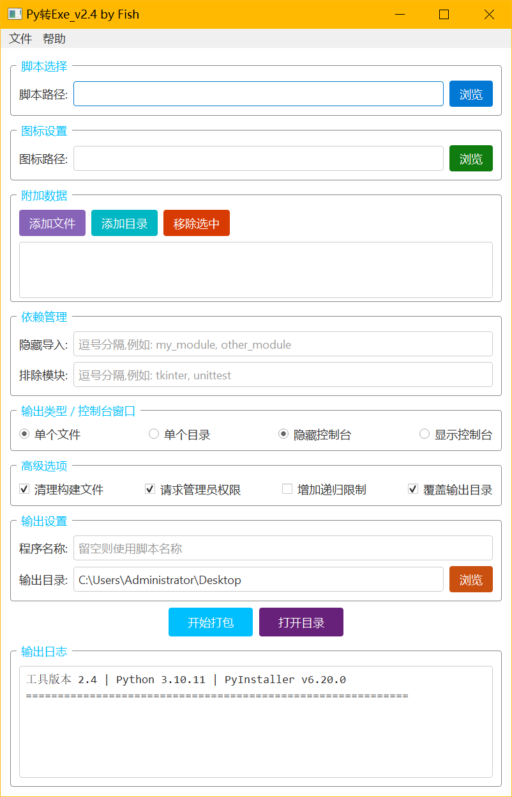

# PyInstaller 智能打包

一个 Windows 桌面工具，用 PyInstaller 将 Python 脚本打包成 exe。工具提供图形界面，支持选择脚本、图标、附加数据、隐藏导入、排除模块、输出目录和常见打包选项。

## 运行截图



## 功能

- 选择 `.py` / `.pyw` 脚本并生成可执行文件。
- 支持单文件或单目录输出。
- 支持隐藏控制台或显示控制台。
- 支持自定义图标、程序名称和输出目录。
- 支持附加文件、附加目录、隐藏导入和排除模块。
- 自动检查 Python 与 PyInstaller 环境。
- 未找到系统 Python 时，可尝试部署便携版 Python。
- 自动扫描脚本依赖并尝试安装常见第三方包。
- 提供打包日志、进度显示和取消打包能力。

## 环境要求

- Windows
- Python 3.9+
- PyQt5
- PyInstaller 5.0+
- requests
- Pillow

## 安装依赖

```powershell
pip install -r requirements.txt
```

## 运行

```powershell
python .\PyInstaller智能打包.pyw
```

也可以直接双击 `PyInstaller智能打包.pyw` 运行。

## 使用

1. 选择需要打包的 Python 脚本。
2. 可选：选择 `.ico` 图标。
3. 可选：添加附加文件或目录。
4. 根据需要填写隐藏导入、排除模块、输出名称和输出目录。
5. 选择输出类型、控制台窗口和高级选项。
6. 点击“开始打包”。

## 开源赞助


